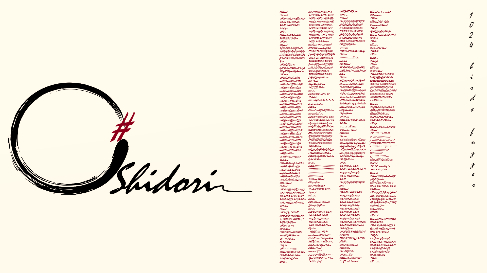

# CShidori 

## 1024 Birds for your fuzzer

[](https://www.gnu.org/licenses/gpl-3.0)

[](https://github.com/dwyl/esta/issues)



## The idea

CShidori combines mutation and generation techniques to help you to find vulnerabilites in any applicaitons.
The best ways to use CShidori is to give him the intended input and generate data to your tests.
Then use your favorite tool (Zap, Ffuf, Burp, Sockets, UnitTestFunction etc...) to leverage fuzzing test.

## The result

Discovered with this tool:

* Open Redirect: 1
* IDOR: 1
* XSS: 1
* XXE: 3
* SQLI: 1
* Application Data Leak: 2
* HTTP Smuggling: 1

## Disclaimer

Usage of all tools on this site for attacking targets without prior mutual consent is illegal. It is the end user's responsibility to obey all applicable local, state and federal laws. We assume no liability and are not responsible for any misuse or damage caused by this site. This tools is provided "as is" without warranty of any kind.

## References

* Taisen: [Website](https://taisen.fr)

* CShidori is part of [SIMPLE project (fr)](https://github.com/Aif4thah/SIMPLE)

* OWASP Web Application Security Testing Guide: [07-Input Validation Testing](https://owasp.org/www-project-web-security-testing-guide/latest/4-Web_Application_Security_Testing/07-Input_Validation_Testing/)

* OWASP Web Application Security Testing Guide: [C-Fuzz Vectors](https://owasp.org/www-project-web-security-testing-guide/v41/6-Appendix/C-Fuzz_Vectors#replacive-fuzzing)

### Data Generation
* Mutation
* Wordlist generation
* Encoding

### Embedded Templates

* CSRF
* XXE

### Payloads

* Chars (default)
* Strings (default)
* DotNet
* Java
* C
* Angular
* JavaScript

## Data Generation

### Mutation

generate 5 mutation (chars and bitflip) for the value "test" :

```powershell
.\CShidori.exe -m mut -o 5 -p test -d Chars
```

### Encode

```powershell
.\CShidori.exe -m enc -p "<script>alert(1)</script>"
```

### WordList Generation

Generate a payload list

```powershell
.\CShidori.exe -m gen -d Chars,Java
```

### CSRF

Generate get and post CSRF exploits

```powershell
.\CShidori.exe -m csrf -o get -p http://target.lan -i "name1=value1&name2=value2"
.\CShidori.exe -m csrf -o post -p http://target.lan -i "name1=value1&name2=value2"

```

### XXE

Generate XXE payload

```powershell
.\CShidori.exe -m xxe
```

## Miscellaneous

### Unit TEST

CShidori run MSTEST to fuzz himself,
these tests can be run somewhere else, read the sources.

### Why SOAP & XSD have been removed ?

You can perform it from Visual Studio:
1. Merge all XSD files in WSDL file
2. Right click on the project and select "Add Service Reference" -> "WCF" -> "enter localPath"

### Why TLS and TCP fuzzing function have been removed ?

there is already many and many tools that do this job
